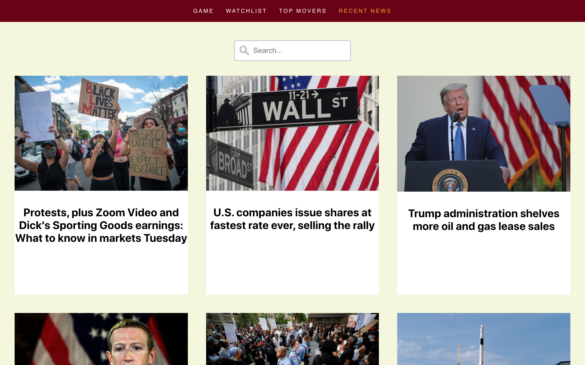
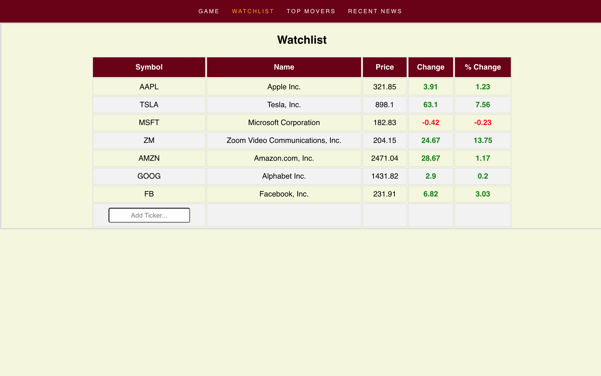
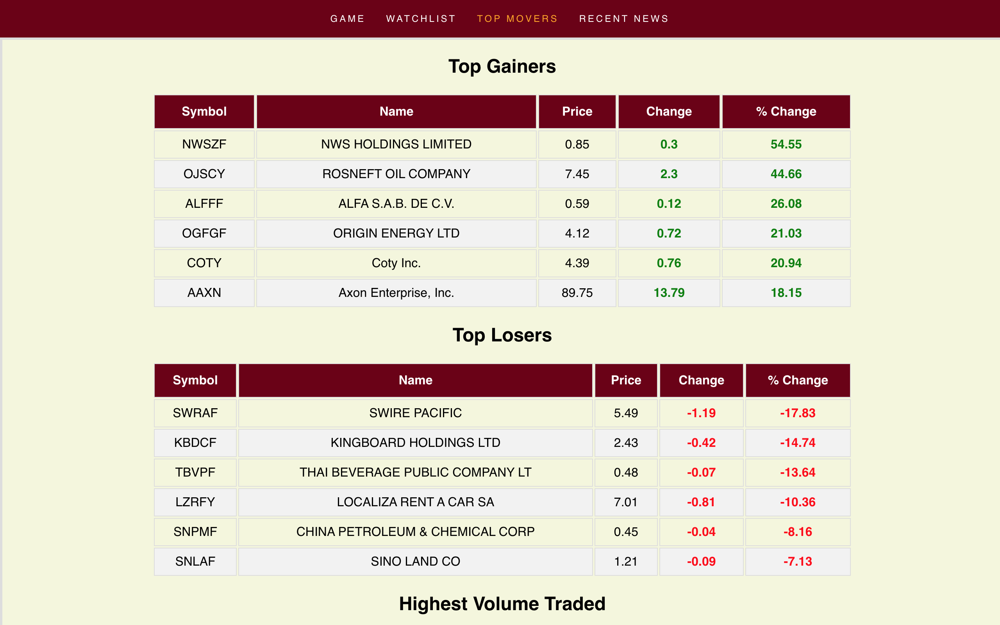

# Stock Exchange Assistant

## Description
Having just started investing in the stock market and with the goal of learning react.js, I spent a summer developing a stock exchange trading assistant using the Yahoo Finance API. After developing this application, I truly learnt the basics of react web development and was able to lead a group of 6 members to develop their own version of this project hosted <a href="https://emilyzwang.github.io/StockAssistant/">here</a>. Both projects was built up from scratch to consist of the following features: 
* Watchlist of favorite stocks (locally saved)
* Table displaying the top gainer/losers/highest volume traded
* Desktop notifications when a stock is hits a certain price
* Recent News tab with a search bar to search for stock-specific news
* A game testing investment knowledge: you start with $1000 and are given a random month and year to put all you have into one stock, which stock would you pick to maximize rewards.

The application is hosted <a href="https://stockology.netlify.app/">here</a>, but has been disconnected from the API. 

## Screenshots
|         |         |            |
| :-------------: | :-------------: | :-------------: |
| Watchlist | Top Movers | Recent News |

